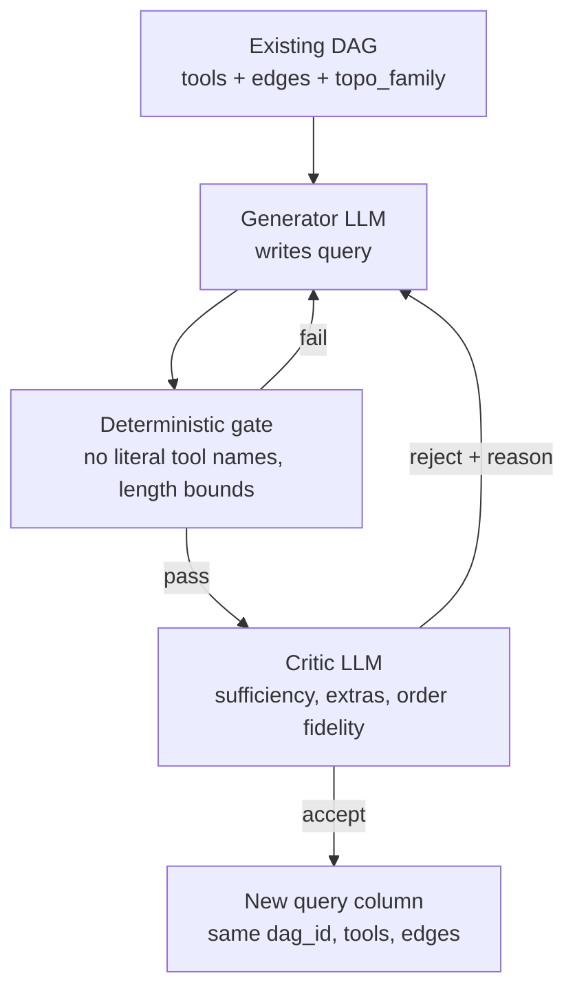

# LLM-Based Query Generation — Design Proposal

Status: **design for discussion, not implemented.**

**Scope (decided): queries only.** Topology generation stays with the existing
scripted `gen_*` functions. We replace only `_synthesize_queries`, the
template-based natural-language layer.

Proposal for replacing the scripted query generator with an LLM
generate-and-critique pipeline, evaluated as a template-robustness test, with an
optional finetuned-SLM extension.

---

## 1. What the current scripted generator does

The corpus is built by two decoupled steps.

**Topology** comes from hardcoded generator functions in `src/utils/graph_utils.py`.
Each has a *fixed* edge list and randomly samples tools onto it:

```python
def gen_diamond(rng, vocab):
    tools = _sample_tools(rng, 4, vocab)      # 4 random tools
    edges = [(0, 1), (0, 2), (1, 3), (2, 3)]  # always this shape
    return tools, edges
```

There are 12 such generators (`gen_diamond`, `gen_hourglass`, `gen_w_shape`,
`gen_double_diamond`, `gen_repeated_tool`, ...), dispatched by
`generate_dags(n_dags, families, vocab, seed)` at `src/utils/graph_utils.py:364`.

**Queries** come from `_synthesize_queries` in `src/data_synth.py`, which fills
hardcoded sentence patterns from a `_TOOL_PHRASES` lookup plus `_Q_OPENERS`,
then substitutes entities via `_fill()`.

### The core weakness

**Structure and semantics are independent.** `gen_diamond` imposes a diamond on
four tools chosen uniformly at random, with no regard for whether those tools
have any real dependency relationship. A generated "diamond" may be
`rollback_deployment -> tag_resource`, `rollback_deployment -> merge_accounts`,
`tag_resource -> export_data`, `merge_accounts -> export_data` — structurally a
valid diamond, semantically arbitrary. The query is then written to describe
whatever was produced.

This matters for the paper's central claim. LEGR is supposed to learn that
topology carries meaning, but a corpus where topology is assigned at random
cannot teach that. It also weakens the held-out-topology result: generalizing to
"unseen diamonds" is easier when diamonds are structurally uniform by
construction.

**Note on the chosen scope.** Fixing the above requires replacing *topology*
generation, which is deliberately out of scope for this proposal. Queries-only
addresses a narrower but more immediately testable concern: whether the reported
results depend on template phrasing. It is the cheaper first experiment and
isolates the language side.

### Why queries-only inverts the problem

The existing Stage-0 module (`src/dag_extract.py`) solves text -> DAG. Queries-only
is DAG -> text, so most of that machinery does not apply: the input DAG comes from
`gen_diamond` and is already acyclic and vocabulary-valid by construction. There
is no cycle to break, no per-edge confidence to score, and no structural validity
to enforce. `break_cycles_min_confidence` and `check_structural_validity` are not
used in this design.

---

## 2. Evidence that naive one-shot LLM generation is not enough

We audited the existing generative baselines on the 30-tool held-out split (332
examples, `scripts/audit_dag_validity.py`). Structural validity was previously
never checked — the prompt asks for a valid DAG but nothing verified it.

| Metric | Llama 3.2 | GPT-OSS 120B |
|---|---|---|
| Parse failures | 8 (2.4%) | 247 (74.4%) |
| Cyclic graphs (of parsed) | **11.1%** | 0.0% |
| Structurally valid (of parsed) | 49.7% | 100% |
| Tool-set F1 (parsed only) | 0.738 | 0.941 |
| Exact match (all) | 11.1% | 21.1% |

Two conclusions:

1. **A single generation pass is unreliable.** Llama emits cyclic,
   non-executable plans 11% of the time; GPT-OSS fails to return parseable
   output on 74% of queries. Neither exceeds 21% exact match on topology.
2. **The failure modes are complementary**, so a critic must check both output
   well-formedness and structural validity — not just one.

This is the empirical case for a **critique-and-repair loop** rather than
one-shot generation.

---

## 3. Proposed pipeline

Input is an **existing DAG** from the scripted generators. Output is a natural
language query describing it. The DAG itself is never modified, so `tools`,
`edges`, `dag_id`, and `topo_family` all carry through unchanged.



### Stage A — Input

For each DAG already in the corpus, pass the generator:

- the ordered `tools` list and `edges` (as a readable dependency description)
- `TOOL_DESCRIPTIONS` for the tools involved, so it knows what each does
- the entity placeholders the templates use (`{user}`, `{order}`, `{dept}`,
  `{server}`) or concrete sampled values

Deliberately **not** passed: the existing template query, to avoid the model
simply paraphrasing it and inheriting template structure.

### Stage B — Generator LLM

Writes `queries_per_dag` distinct natural language queries (currently 4, per
`configs/pipeline_config.json`) for the given DAG. It must convey the dependency
structure without naming tool functions.

### Stage C — Deterministic gate

Cheap exact checks, run before spending a critic call:

- **No literal tool names.** Reject if the query contains any `TOOL_VOCAB` string
  or its de-underscored form (`rollback_deployment`, `rollback deployment`).
  This is the leakage guard.
- Length and formatting bounds; non-empty; single request not a numbered list.
- Duplicate check against queries already accepted for the same `dag_id`.

Note this is a much thinner gate than the text -> DAG direction requires, because
the DAG is valid by construction.

### Stage D — Critic LLM

Given the DAG and the candidate query, each check returns pass/fail with a reason
so rejections can be fed back to the generator:

1. **Sufficiency** — does satisfying the query require *every* tool in the DAG?
2. **No extras** — does the query imply work that would need tools *not* in the
   DAG?
3. **Order fidelity** — does the phrasing reflect the actual topology?
   Sequential edges should read as dependent steps; sibling branches should read
   as parallel or simultaneous. **This is the most important criterion**, since
   LEGR's core task is distinguishing a chain from a fan-out over the same tool
   set. A query that flattens a diamond into a list teaches the model nothing.
4. **Naturalness** — would an operator plausibly write this?

On reject, the generator retries with the critic's reason, up to `N` attempts
(propose `N = 2`), after which the sample is discarded and logged.

### Stage E — Output

Emit the standard schema
(`query, dag_id, dag_text, tools, edges, topo_family, source, split`) with
`source=llm_query`. Because DAGs are reused as-is, no dedup on
`dag_canonical_hash` or split reassignment is needed — each generated query
inherits the split of its parent DAG, preserving the family-disjoint guarantee.

---

## 4. Evaluation plan

### Critical constraint: do not overwrite the existing queries

Regenerating the `query` column in place would **invalidate every number in the
paper**. Routing accuracy (Experiment 1), LEGR Recall@5, and the BM25 / S-BERT
baselines were all computed against template queries.

Instead, emit LLM queries as an **additional evaluation split over the same
DAGs**, leaving the current corpus untouched. Nothing is invalidated, and the
comparison becomes a controlled A/B on phrasing alone: identical DAGs, identical
splits, only the query text differs.

### The decisive experiment: template-robustness

Evaluate the **already-trained** LEGR checkpoint (no retraining) on the
LLM-written queries for the held-out test DAGs, alongside BM25 and S-BERT.

| Outcome | Interpretation |
|---|---|
| Recall@5 stays near 1.0 | LEGR generalizes across phrasing; kills the "results are a template artifact" objection |
| Recall@5 drops materially | The reported numbers partly reflect template regularity — important to know before a reviewer finds it |

Report BM25 and S-BERT on the same split. If the baselines *improve* on LLM
queries, that likely signals tool-name leakage the deterministic gate missed, and
is a diagnostic rather than a real result.

### Generation quality (secondary)

- Acceptance rate; rejection counts broken down by critic criterion
- Deterministic-gate rejection rate, especially the leakage guard
- Lexical overlap between generated queries and tool names, compared against the
  template corpus as reference — confirms difficulty was not accidentally lowered
- Distinctness of the 4 queries generated per DAG

### Optional

Train a LEGR variant on LLM-written training queries and evaluate on template
test queries, and vice versa. The cross-phrasing matrix isolates whether the
model is learning phrasing conventions or genuine structure.

---

## 5. Optional extension — finetuned SLM

Longer-term, and requiring the reverse direction (query -> DAG), finetune a small
open-weight model to give a three-way comparison:

| Approach | Cost | What it tests |
|---|---|---|
| Prompted frontier LLM | High latency, no training | Zero-shot planning ceiling |
| Finetuned SLM (1-3B) | One-time training | Can a small model internalize topology? |
| LEGR retrieval | 23.5M params, ~4ms | Retrieval vs. generation |

Candidates already available locally: `llama3.2`, `qwen3:30b`, `gpt-oss:20b`.
Note this is a *separate* line of work from queries-only generation: it consumes
(query, DAG) pairs rather than producing queries, and would benefit from the
LLM-written queries as additional training signal.

---

## 6. Framing: contribution vs. tooling

Two ways to land this, with different rigor bars.

**As tooling.** One or two sentences in the Dataset section noting that queries
were LLM-generated with a validation pass. No separate evaluation. The benefit is
indirect: a more realistic corpus makes the existing LEGR results more credible.

**As a contribution.** A short subsection reporting the template-robustness
result from Section 4. This is the recommended middle path: it is cheap, uses an
already-trained checkpoint, and directly answers a question a reviewer will ask
anyway ("your queries are templated, so of course a model matches them"). It does
not require claiming the generation method is novel.

---

## 7. Open questions for discussion

1. **Critic model** — same model as generator (cheap, risks shared blind spots),
   a stronger model (better, costlier), or deterministic-gate-only for v1?
2. **Should the critic be able to rewrite the query**, or only accept/reject with
   a reason? Rewriting converges faster but makes it harder to attribute quality.
3. **Retry budget** — is `N = 2` right, and do we log or discard failures?
4. **How strict is the leakage guard?** Exact tool-name matching is the floor;
   do we also reject close paraphrases, and if so how do we avoid making the
   generated queries systematically harder than the templates?
5. **Order-fidelity grading** — is a binary pass/fail enough for criterion 3, or
   do we need a graded score to compare against template phrasing?
6. Framing per Section 6: tooling line, or the robustness subsection?

*Resolved:* scope is queries-only (topology generation stays scripted).

---

## 8. What already exists

Because queries-only runs DAG -> text, most of the existing Stage-0 module does
**not** transfer. Honest accounting:

| Component | Location | Reusable here? |
|---|---|---|
| LLM backend abstraction | `src/llm_backends.py` | Yes — Ollama / Gemini calls |
| Progress + resume harness | `src/llm_dag_baseline.py` | Yes — pattern for long runs |
| Topology classifier | `classify_topology` in `src/utils/graph_utils.py` | Yes — label parent DAGs |
| Scripted DAG generators | `gen_*` in `src/utils/graph_utils.py` | Yes — unchanged, supplies input |
| Confidence-weighted repair | `break_cycles_min_confidence` in `src/dag_extract.py` | No — input DAG already acyclic |
| Cycle detection / validity | `check_structural_validity` in `src/dag_extract.py` | No — same reason |
| Confidence-scored parsing | `parse_extraction_response` in `src/dag_extract.py` | No — different output shape |

Not built: the query-generation prompt, the leakage gate, the critic pass, the
retry loop, and the template-robustness evaluation.

---

## References

- DAG-LLM Pipeline, https://github.com/krumiaa/DAGLLM (Apache-2.0),
  https://doi.org/10.5281/zenodo.17210060 — reference for LLM-driven graph
  construction with per-edge confidence and a validation pass. Its
  extract-then-enforce acyclicity mechanism applies to the text -> DAG direction
  rather than the query-generation direction proposed here.
